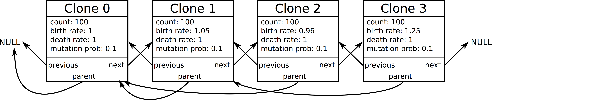
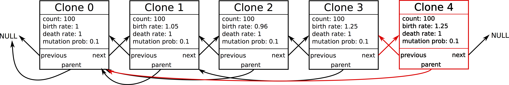

SIApopr was created in a modular manner that separates each action in the
branching process simulation to allow flexibility when creating new models.
Advanced users with some C++ experience can create new fitness distibutions
instead of the provided double exponential, normal, and uniform ones. Users
can also customize inheritable properties of new clones such as fitness
rate, models of epistasis, or different punctuated models that determine
the number of new mutations in a new clone.

SIApopr implements a plugin system to allow this customization without a
reduction in speed. The user provides a new C++ function that follows the same
structure as a provided template. The R functions `compile_custom_fitness`
and `compile_custom_newclone` write the necessary header file, compiles the
function and builds a shared library (.so or .dll file) that the user can
point to when calling SIApopr in R.

Doing so requires some basic knowledge of C++ and the underlying data structure
for a branching process in SIApopr. This vignette covers the underlying data
structure of an infinite-allele birth-death process in SIApopr and the
necessary elements to customize a new model. The plugin system is currently
only in place for time-homogeneous models.

# SIApopr's infinite-allele branching process data structure

The underlying data structure of the infinite-allele branching process is a
double-linked list containing clone structures as elements. Clones are linked
to previous and next clones based on their order of appareant. Each clone is
also linked to its parent clone. A clone structure contains the following
members:

|Element Name          | Description|
|----------------------|---------------------------------|
|std::string clone_id  | The clone ID lists the alleles contained|
|int subclone_count    | The number of daughter subclones for a particular clone|
|int cell_count        | Current number of cells in the clone|
|int allele_count      | Current number of cells in the population containing the new allele|
|int mut_count         | Current number of mutant alleles in the clone|
|int driver_count      | Number of driver mutant alleles|
|bool is_driver        | TRUE/FALSE if new mutant allele in current clone is a driver|
|double mut_prob       | Probability that one daughter of a new clone has a mutant|
|double birth_rate     | birth rate of all cells in clone|
|double death_rate     | death rate of all cells in the clone|
|double clone_time     | Time of appearance of the new clone|
|struct clone *parent  | pointer to parent clone|
|struct clone *nextnode| pointer to next clone in list (ordered by time of appearance)|
|struct clone *prevnode| pointer to previous node in list

As new clones enter the population, the infinite-allele model assumes new
alleles are present in each clone. Alleles are identified by the order they
enterred the popoulation, so "1" would be the first mutant allele. The element
`clone_id` is a string that is inherited by a clone from its parent. The new
allele number is appended to that string so that the ID can track an
individual's ancestry. For example, "2>4>12" refers to a clone that contains
alleles "2", "4", and "12" and is a daughter clone of "2>4". The clone_id
can be customized, but it is not recommended since appending exists in another
piece of the code.

The main elements that are alterable are `driver_count`, `is_driver`, `mut_prob`,
`birth_rate`, and `death_rate` from each clone. More information about how to
customize and use global parameters is given later.

The linked list has the following structure
```{r, out.width = "600px", echo = F}

```

A new clone is added to the end and the list is updated by linking the
clones to their respective previous and next clones as well as the parent clone.
This is done automatically by SIApopr.

```{r, out.width = "600px", echo = F}

```

## Global parameters

Global structures are created at import that are used throughout a simulation.
These structures include parameters for fitness distributions, mutation
distributions, epistatic parameters, and punctuated parameters. These can all
be modified or used in a new clone plugin. The `customclone` function contains
arguments that are pointers to each of these structures. Modifying the values
pointed to affects the whole simulation since these parameters are global, so it
is usually better to access them without modifying their values.

Descriptions of each parameter follows. Note that since these parameters are
only used when creating new clones (and a new fitness distribution for fitness
parameters), they don't necessarily have to reflect their name and can be used
for other purposes.

#### Fitness parameters

| Parameter Name | Description |
| -------------- |-----------------------------------|
|  std::string fitness_distribution | "doubleexp", "normal", "uniform", or "custom"|
|  bool is_randfitness | set as TRUE/FALSE if the model is a random fitness model|
|  double alpha_fitness | alpha parameter for fitness distribution|
|  double beta_fitness | beta parameter for fitness distribution|
|  double pass_prob | probability of a passenger mutation (no change in fitness)|
|  double upper_fitness | upper bound on fitness|
|  double lower_fitness | lower bound on fitness|
  
The parameters `alpha_fitness` and `beta_fitness` have different values
depending on the distribution used. For a double exponential, it represents
the rate parameter on the positive (alpha) and negative (beta) halves of the
distribution. For the normal model, they represent the mean and standard
deviation respectively. For the uniform distribution, they represent the lower
and upper bounds.

For a custom distribution, any of the parameters can represent any parameter
of a distribution desired.

### Mutation parameters

Currently the mutation distribution is only a Beta distribution. If the mutation
probability is modified, it needs to be set between 0 and 1 in the plugin.

| Parameter Name | Description |
| -------------- |------------------------------------|
|  bool is_mutator| TRUE/FALSE if a mutation distribution is used
|  double alpha_mutation| alpha parameter
|  double beta_mutation| beta parameter
|  double pass_prob| probability of no change in the mutation distribution

### Punctuation parameters

| Parameter Name | Description |
| ----------------- |--------------------------------------|
|    bool is_punctuated | TRUE/FALSE if a punctuated mode is used |
|    double punctuated_prob | probability of a punctuated event occuring |
|    double poisson_param | Parameter associated with a zero-truncated poisson distribution to determine the number of mutations |
|    double punctuated_multiplier | multiplier effect on the fitness of a new clone due to a punctuated event |
|    double punctuated_advantageous_prob | probability that the punctuated event has an advantageous effect (otherwise the clone is given a low rate that ensures it goes extinct.|

When building a custom model, there is also an int* parameter for the plugin named
`number_mutations`. The number of new mutant alleles added on to a new clone is
determined by this value. In the punctuated model, this value is determined by
a zero-truncated Poisson random variable.


### Epistatic Parameters

| Parameter Name | Description |
| -------------- |-----------------------------------------|
|   bool is_epistasis | TRUE/FALSE if an epistatic model is used |
|   int epistatic_mutation_thresh | number of mutations in a clone required for an epistatic event |
|   double epistatic_multiplier | amount to multiply fitness by in an epistatic event |


# Distribution Plugin Customization
The template for a distribution is given below. The arguments for the distribution
are all pointers that may be modified, but only `double* fitness` should be. The
fitness of a new clone is equal to the parents fitness added to this new value
in the provided fitness distribution model. The FitnessParameters structure
pointer, fit_params, points to a global structure. Elements of it are accessed
using the arrow operator `->`. SIApopr uses the
[GNU Scientific Library](https://www.gnu.org/software/gsl/) for most mathematical
functions. Different distributions can be found [here](https://www.gnu.org/software/gsl/manual/html_node/Random-Number-Distributions.html).
The random number generator pointer, `rng` should not be changed.

A template for the distribution function is:
```{r engine='Rcpp', eval = F}
// Do not change the function name or arguments
void customdist(double* fitness, struct FitnessParameters *fit_params, gsl_rng* rng)
{
  // add code here
  (*fitness) = 1;//assign fitness here;
}
```


The following example shows a beta distribution with a point mass at 0 that has
been shifted down by 0.5 so that the domain is [-0.5, 0.5]. The value
assigned to (*fitness) is used as the additional fitness for a new clone.
```{r engine='Rcpp', eval = F}
// Do not change the function name or arguments
void customdist(double* fitness, struct FitnessParameters *fit_params, gsl_rng* rng)
{
  double z = gsl_ran_flat(rng, 0, 1);
  if( (z > fit_params->pass_prob) )
  {
    (*fitness) = gsl_ran_beta(rng, fit_params->alpha_fitness, fit_params->beta_fitness) - 0.5;
  }
  else
  {
    (*fitness) = 0;
  }
}
```

## Running SIApopr with a new distribution function

Create a custom fitness distribution by writing a `customdist` function using
the provided template which can be generated with the function
```{r, eval = F}
create_fitness_template("file/name.cpp")
```
After customizing the
distribution, run the function
```{r, eval = F}
compile_custom_fitness("file/name.cpp")
```
which creates the necessary headers, compiles, and builds the shared library
file "file/name.so". Then, running `siapopConstant` or `siapopTimeDep` with the
parameters `distribution_function = "custom"` and
`custom_distribution_file = "file/name.so"` to run.


# Model Plugin Customization (siapopConstant only)
Creating a new model requires some knowledge of C++ and the underlying data
structures used in SIApopr mentioned in a previous section. The template for
creating a new plugin is given below. The arguments for `customclone` are
pointers to the new clone being created, its parent clone, the global parameters
in their respective structures, the number of mutant alleles to assign to a
new clone, the random number generator, and a pointer to the function
`ConstantGenerateFitness` which generates the new additional fitness value
for a new clone to be added to the birth rate.

The structures can each be used, and other functions are provided to allow
changes to a new clone. Linking the clone to the end of the list is done outside
this function, so new_clone currently has **NULL** values for its parent_clone,
next_node, and previous_node.
```{r engine='Rcpp', eval = F}
// Do not change the function name or arguments
void customclone(struct clone *new_clone, struct clone *parent_clone,
  struct FitnessParameters* fit_params_ptr, struct MutationParameters* mut_params_ptr,
  struct PunctuationParameters* punct_params_ptr,
  struct EpistaticParameters* epi_params_ptr, int number_mutations*, gsl_rng* rng,
  void (*ConstantGenerateFitness)(double *, struct FitnessParameters*, gsl_rng*))
{
  // additional code

  // To sample from a fitness distribution and assign the new fitness to
  // additional_rate (not required)
  //double additional_rate = 0;
  //(*ConstantGenerateFitness)(&additional_rate, fit_params_ptr, rng);
  
  // double ConstantGenerateMutationProb(MutationParameters mut_params, gsl_rng* rng);
  // int ConstantGeneratePunctuation(PunctuationParameters punct_params, gsl_rng* rng);

  //additional code
}
```

The function to generate the new mutation probability is
```{r engine='Rcpp', eval = F}
double ConstantGenerateMutationProb(MutationParameters mut_params, gsl_rng* rng);
```
and the function to generate the number of new mutant alleles in a punctuated
model (zero-truncated Poisson distribution) is
```{r engine='Rcpp', eval = F}
int ConstantGeneratePunctuation(PunctuationParameters punct_params, gsl_rng* rng);
```

The user is not limited to these functions, but has the ability to create new
scenarios in this space, so generation of different distributions that affect
other parameters is possible here. To alter specific elements of the clone
structure, use the arrow operator, `->`. For an extreme example, if a
replication of a new clone occurs via rupture and release as in viruses, the
number of new cells upon creation of the new clone can be set by
```{r engine='Rcpp', eval = F}
new_clone->cell_count = 10;
```
or if the birth of a new clone causes the parent clone to become dormant
(another extremely unlikely example), this can be achieved by
```{r engine='Rcpp', eval = F}
parent_clone->parent_clone->birth_rate = 0;
parent_clone->parent_clone->death_rate = 0;
```

We give below an example where when a new clone arises, it becomes the only
clone capable of further mutating. We do this by setting the parent mutation
probability to 0. This should simulate a single lineage of an infinite-allele
population. Further, we can sample the new clone's mutation rate and fitness
from distributions.
```{r engine='Rcpp', eval = F}
// Do not change the function name or arguments
void customclone(struct clone *new_clone, struct clone *parent_clone,
  struct FitnessParameters* fit_params_ptr, struct MutationParameters* mut_params_ptr,
  struct PunctuationParameters* punct_params_ptr,
  struct EpistaticParameters* epi_params_ptr, int number_mutations*, gsl_rng* rng,
  void (*ConstantGenerateFitness)(double *, struct FitnessParameters*, gsl_rng*))
{
  parent_clone->mut_prob = 0;
  
  double additional_rate = 0;
  (*ConstantGenerateFitness)(&additional_rate, fit_params_ptr, rng);
  new_clone->birth_rate = new_clone->birth_rate + additional_rate;
  new_clone->mut_prob = ConstantGenerateMutationProb(MutationParameters mut_params, gsl_rng* rng);
  //additional code
}
```

## Running SIApopr with a new clone plugin

Like the custom distribution, create a custom new clone plugin by writing a
`customclone` function using the provided template that is generated with the
function
```{r, eval = F}
create_newclone_template("file/name.cpp")
```
After customizing the distribution, run the function
```{r, eval = F}
compile_custom_newclone("file/name.cpp")
```
which creates the necessary headers, compiles, and builds the shared library
file "file/name.so". Then, running `siapopConstant` with the parameter
`custom_model_file = "file/name.so"` to run.
